# Data Science 1 - HW 2
**Date:** September 15, 2025  
**Course:** CSYS 5870, Fall 2025  
**Due:** September 15th, 2025, 11:59 PM (Brightspace)

---

## Question 1: Exploratory Data Analysis (20 pts)

### Dataset 1: Independent Expenditure 2024

#### 1) What is the dataset?
[Independent Expenditure 2024](https://www.fec.gov/campaign-finance-data/independent-expenditures-file-description/)

I found this dataset through the Federal Election Commission's official campaign finance data portal. This selection examines independent expenditures - spending by individuals, groups, political committees, corporations, or unions that expressly advocate for or against clearly identified federal candidates. What makes this particularly compelling is that these expenditures must be completely independent; they cannot be coordinated with candidates, their campaigns, or political parties. This creates a fascinating window into the monetary landscape of American politics, where outside groups can spend unlimited amounts to influence elections while maintaining legal separation from official campaigns. 

The dataset captures the 2024 election cycle through two types of reporting mechanisms:
- **48-hour reports**: For expenditures exceeding $10,000 (up to 20 days before an election), organizations must report within two days of public distribution
- **24-hour reports**: For expenditures exceeding $1,000 within the final 19 days before an election, reporting is required within one day

This time-series data reveals the intensity of spending as elections approach, making it particularly valuable for understanding the strategic timing of political influence efforts. The data includes comprehensive details about who spent money, how much, when, for what purpose, and which candidates were targeted - providing transparency into the area of campaign finance.

#### 2) Outside of the dataset

**File Structure:**
- Single file dataset: `independent_expenditure_2024.csv`
- No compression applied
- No copyright information provided
- Standalone file with no accompanying documentation files

**File Format & Size:**
- **Format:** CSV (Comma-Separated Values)
- **File size:** 18.6 MB
- **Data dimensions:** 73,403 rows × 23 columns

#### 3) Inside the dataset

**Data Cleaning Steps:**
The FEC documentation states that duplicates exist and recommends "sorting the records by filer and date and targeted candidate" and examining "amendment indicator columns or report type codes when the same dates and amounts appear". I may have taken a bit of a naive approach in that I sorted appropriately and then dropped duplicates keeping the latest records.

```
df_clean = df.sort_values(['spe_id', 'exp_date', 'cand_id', 'file_num'])
df_clean = df_clean.drop_duplicates(subset=['spe_id', 'exp_date', 'cand_id', 'exp_amo'], keep='last')
```

**Column Data:**
- spe_id: Unique ID of committee, individual or group making expenditure
- exp_date: Date of specific expenditure
- cand_id: Unique ID of candidate for or against whom the expenditure was made
- file_num: Unique identifier for a submission (which may report several disbursements

This process removed 19k~ rows. I verified all unique spenders and candidates were preserved. I definitely could have done a more thorough job, but given this was a new dataset in the interest of time I stuck to my simple approach.

Another issue I found in trying to look at the top spenders in the data was conspicuous spenders in that they spent money in the billions and had names like "The Masonic Illuminati Eye" and "Republican Emo Girl", which collectively spent 12 billion dollars. In doing some research online and in the FEC data portal, I felt it was safe to remove the following from my dataset, and in doing my figures matched the FEC's for the timeframe.

```
spenders_to_remove = [
    'THE COMMITTEE OF 300',
    'THE COURT OF DIVINE JUSTICE', 
    'Republican Emo Girl',
    'The Masonic Illuminati Eye',
    'Gus Associates'
]

rows_to_remove = df['spe_nam'].isin(spenders_to_remove)
df = df[~df['spe_nam'].isin(spenders_to_remove)].copy()
```

**Data Story & Findings:**

This analysis operates on two levels. At the surface, the data chronicles the narrative of a presidential election—the candidates, the messaging, the strategic decisions that shaped public discourse. Beneath that visible campaign lies a more complex story: the intricate financial machinery that unfortunately powers modern American democracy. Through Federal Election Commission expenditure data, we can trace not just what campaigns spent, but how money flows through the political ecosystem, revealing the economic infrastructure that transforms political ambitions into electoral outcomes.

And with that, let us begin our story by introducing our story's main character. Money! Given this data spans 2023-2024, a simple question one could ask right away is how did spending behave over time? As we can see money spent and expenditures increased sharply in the months leading up to the election.

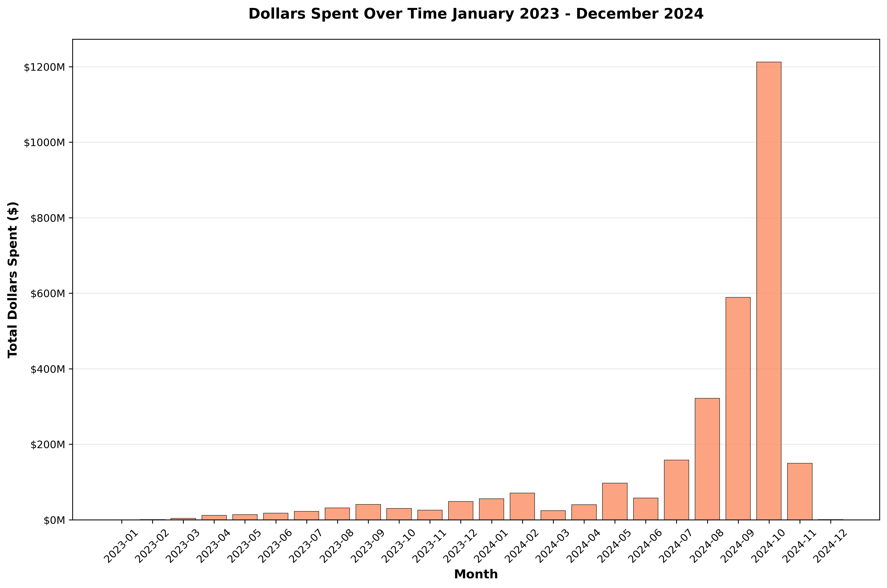


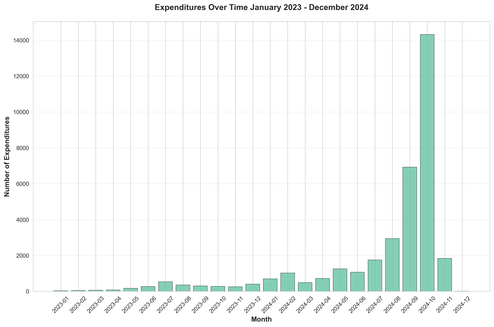

This naturally leads to the questions:
- Who is spending this money?
- What are they spending it on?

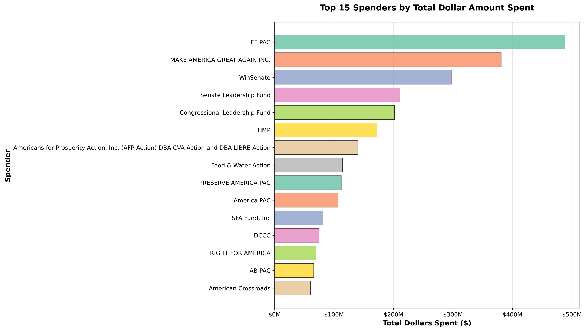

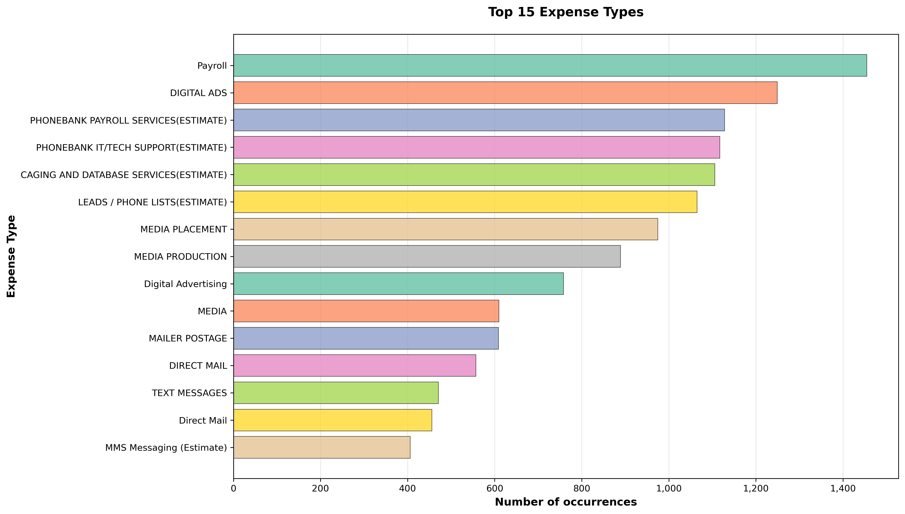

In this data we can see that there is nothing strange or glamorous about the spending patterns. The money is spent on payroll and various methods of outreach to voters. What is unfortunate about this data is the volume of contributing organizations, it's nearly impossible to have a good sense of all the players invested in American politics. Some names stand out like "MAKE AMERICA GREAT AGAIN INC", but unless you have some extensive domain knowledge, the names of these organizations don't tell you much about their mission (i.e. AB PAC).

Next I waned to look at how spending broke down across political party. We can see exactly what we might expect in that the major political parties in the US are the dominating figures. One thing that would be interesting is to look at how minor parties have trended over time.

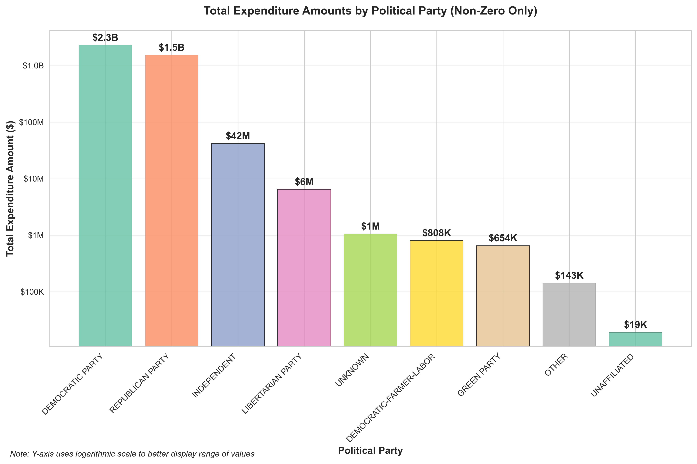

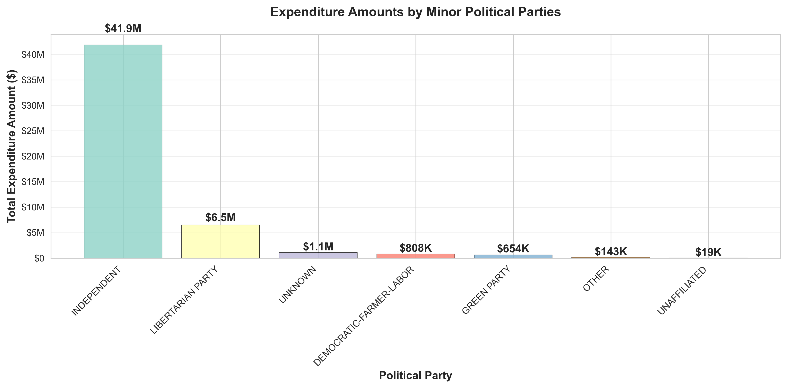

**AI Assistance:** The visualization improvements for party spending analysis were developed with assistance from Claude (Anthropic Sonnet 4). The AI was prompted with "How can we improve this plot so that it better captures spending by party" and provided code optimization and data visualization improvements. Specific changes included generating Python code with logarithmic scaling, filtering zero values, improving currency formatting, and creating a dual-chart approach. All code logic, formatting functions, and visualization principles were reviewed for accuracy before implementation.

Lastly, what kind of story would this be without a power law distribution? Below we can see a power law distribution in a figure that analyzes spending related to candidates. As one might imagine and as seen above, the representatives of the two major parties completely dominate this field.

(I do not love this visualization, but in the interest of time I am living with it.)

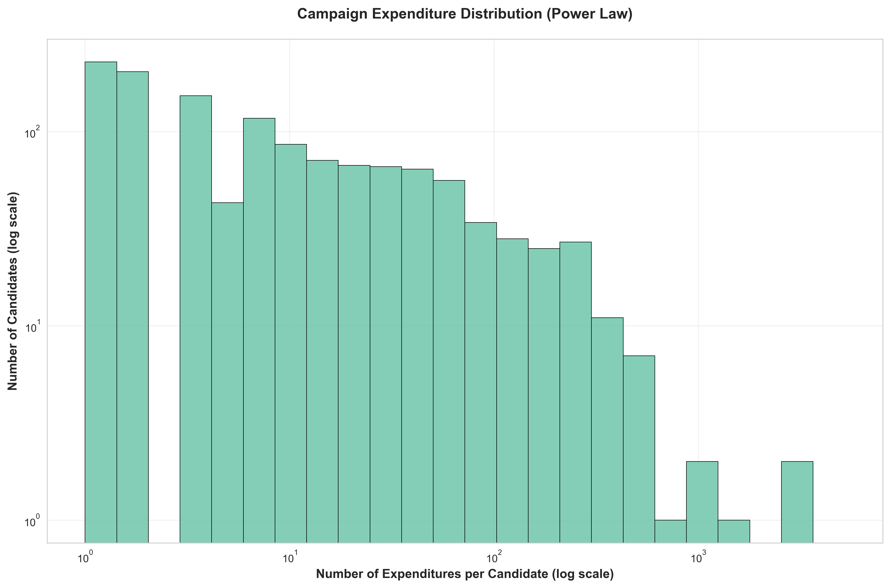

**AI Assistance:** Claude (Anthropic); prompts: "I am trying to capture a power law distribution in plotting campaign expenditure data - looking at Candidates and the count of expenditures... What would be a nice way to plot this as it tails off quickly from here. There are 1,323 entries. I would like to use seaborn. I am thinking a displot and would like some guidance on setting up bins to properly capture this" and "Explain this graph to me"; used for: generating Python code for power law visualization with logarithmic binning and seaborn, and explaining the resulting graph interpretation; changes: adapted the provided code examples to my specific dataset and selected the log-log scale approach; verification: tested the code with my campaign expenditure data, confirmed the power law pattern matches the theoretical expectations, and validated the graph interpretation against the raw data statistics.

#### 4) Research Questions Evolution
Given this is a new dataset I will focus on questions I would love to explore in the future. I will say I have learned 3 major lessons in this project.

- I think I love political data.
- Doing data exploration well takes time.
- Doing data exploration well is hard work and maybe too much fun.

**Future Research Questions:**
- How does the nature of spending differ across party if at all?
- What are the strange expenses? (i.e. Is pizza expensed somewhere?)
- How does spending differ between national and state level races?
- Is money spent any differently when spent in opposition to a candidate versus in favor of?
- How does spending differ across states?
- Which state level races were the most expensive?


---

### Dataset 2: [Dataset Name]
**Note:** Feel free to skip over sections 1 and 2 as they are from previous homework. I am leaving them in to keep formatting consistent and to help provide context.

#### 1) What is the dataset?
[MTA Permanent Art Catalog](https://data.ny.gov/Transportation/MTA-Permanent-Art-Catalog-Beginning-1980/4y8j-9pkd/about_data)

> "Through the Permanent Art Program, MTA Arts & Design (formerly Arts for Transit) commissions public art that is seen by millions of city-dwellers as well as national and international visitors who use the MTA's subways and trains. Arts & Design works closely with the architects and engineers at MTA NYC Transit, Long Island Rail Road and Metro-North Railroad to determine the parameters and sites for the artwork that is to be incorporated into each station scheduled for renovation. A diversity of well-established, mid-career and emerging artists contribute to the growing collection of works created in the materials of the system -mosaic, ceramic, tile, bronze, steel and glass. Artists are chosen through a competitive process that uses selection panels comprised of visual arts professionals and community representatives which review and select artists. This data provides the branch or station and the artist and artwork information."

New York State. (n.d.). MTA Permanent Art Catalog (Beginning 1980) [Dataset]. 
https://data.ny.gov/Transportation/MTA-Permanent-Art-Catalog-Beginning-1980/4y8j-9pkd/about_data

I found this dataset in the 2025.07.16 edition of "Data is Plural". I selected it because I love NYC, and I love art! Art in public spaces is especially meaningful to me in that it can draw us out of our tiny rectangles filled with metrics and ads, and remind us of the beauty and creativity that exist in our fellow humans. Also, it can really spice up the concrete!

#### 2) Outside of the dataset

**File Structure:**
- Single file dataset: `MTA_Permanent_Art_Catalog__Beginning_1980_20250829.csv`
- No compression applied
- The license for this dataset is unspecified.
- There was no copyright information provided in the documentation. However, it is stated that Metropolitan Transportation is the owner. There is also a terms of use located [here](https://data.ny.gov/dataset/OPEN-NY-Terms-Of-Use/77gx-ii52/about_data).

**File Format & Size:**
- **Format:** CSV (Comma-Separated Values)
- **File size:** 523.4 KB
- **Data dimensions:** 381 rows × 9 columns

#### 3) Inside the dataset
Each row in the dataset represents an art installation and contains the following:
- 3 columns related to location: agency, station name, and line
- Artist
- Art Title
- Art Date
- Art Material
- Art Description - represented as a comma seprated list - more on that below
- Art image link

**Data Cleaning Steps:**
The biggest issue with the data was that the feature I was most interested in looking into, "Art Material" was represented as a comma separated list for each installation. (e.g. Ceramic tile, red clay, glazes, WonderBoard panel backing) To explore how individual materials were used in relation to other features required some manipulation.

There was probably a better way to do this, but I handled it the same way on 2 different features as I was interested in looking at the usage of materials across agency and artists that appeared more than once. The trick here was to create a new DataFrame that contained one row for each individual material and the related feature I was interested in. This allowed me to do further analysis. One data issue here to point out is that some materials were captured as "Glass mosaic" and othres "Glass Mosaic". Lower casing was crucial!

Example:
```
tidier_material_data = []
for idx, row in df.iterrows():
    feature_of_interest = row['Feature of interest']
    materials_list = [material.strip().lower() for material in row['Art Material'].split(',')]
    
    for material in materials_list:
        tidier_material_data.append({
            'Feature': feature_of_interest,
            'Material': material
        })
tidier_material_df = pd.DataFrame(tidier_material_data)
```


**Data Story & Findings:**
This is a story about art in public spaces. It takes place over the course of over 30 years. This leads to my first question. What does the distribution of art installations over time look like? This was a simple task in that "Art date" was represented as a `int64` value.

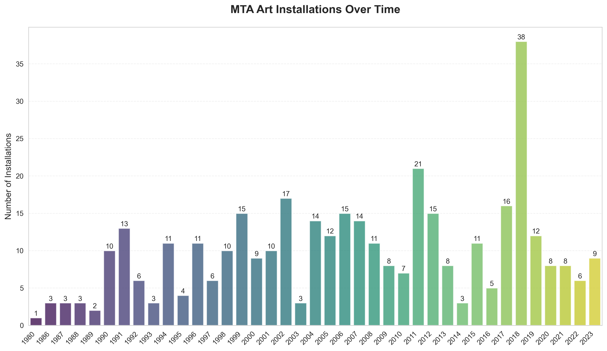

Looking at this data, given the mean is nearly 10 installations per year, it would be interesting to investigate years when the number of installations was far below, especially after the project seemed to have taken off. Also, what caused the explosion in 2018?

In constructing a story, in addition to time one must discuss geography. The lay of the land consists of 6 unique agencies, 309 unique stations, and 113 unique lines. This is part of a system that serves "15.3 million people across a 5,000-square-mile travel area surrounding New York City, Long Island, southeastern New York State, and Connecticut" ([Metropolitan Transportation Authority](https://www.mta.info/about)).

In exploring the landscape I focused on agencies and materials. Before relating materials to other features let's first take a look at 10 most used materials across the dataset. Variations on glass materials are clearly the most used. An additional tidying step if time permitted would have been to carefully group these into similar themes. This may have lead to some richer visualizations.

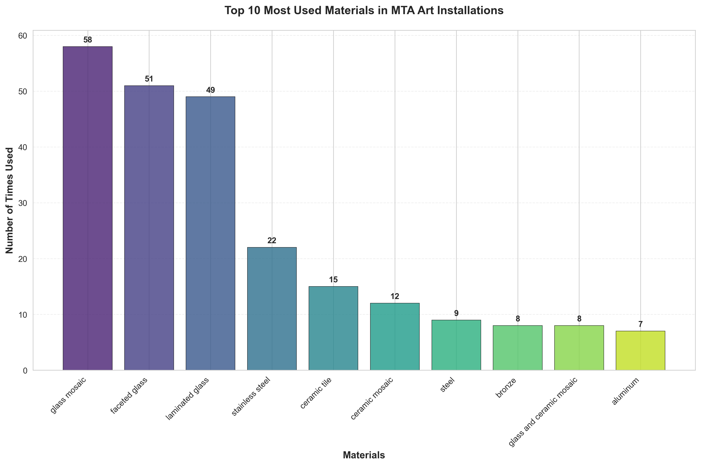

In looking at how materials varied across location I chose to work with agency because this feature was at the top of the geographic hierarchy meaning each row contained an agency entry. The question I researched here was how did material usage vary across agency? There were over 200 unique materials used across the dataset. They included variations on glass, ceramics, metals and even "found objects". To visualize this I created a heatmap, which examines the usage of the 10 most popular materials across agency. NYCT, or New York City Transit, which serves all bus and subway services across the city dominates in the usage of these top materials. One thing I would have like to look at if given more time would have been which agency had the greatest material diversity.

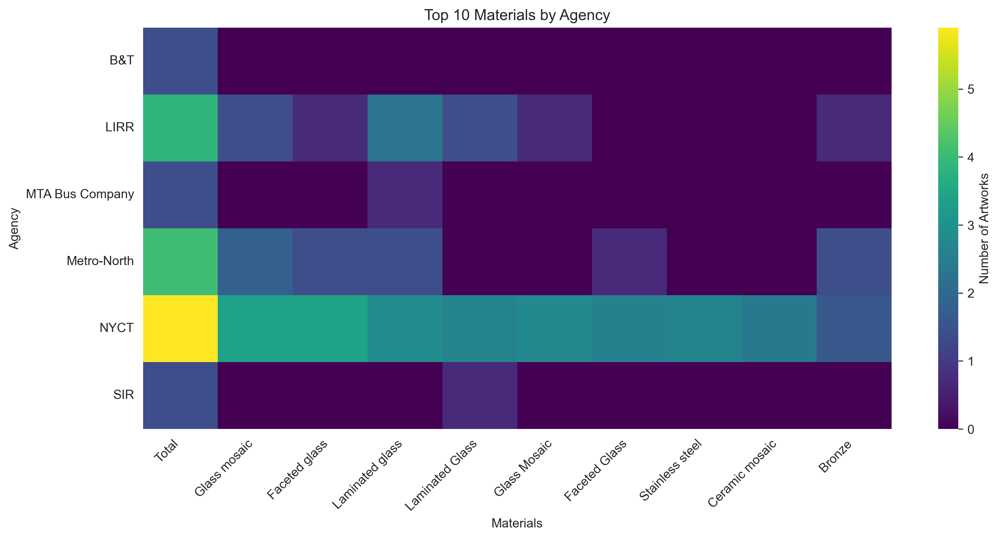

**AI assistance**: Claude (Anthropic); prompts: "Is it possible create a new dataframe with agency on the y axis and maybe material on x, and we could have a count of each time the material was used for observation."; used for cross-tabulation matrix creation, data processing methodology, and comprehensive verification system; changes: created station-material and agency-material cross-tabulation matrices with heatmap visualizations, implemented 9-point data verification system, and generated analysis code; verification: cross-checked manual calculations against automated results, verified matrix consistency, and performed statistical validation of data transformations.

Next in our story, we introduce the main characters, the artists! There were 334 unique artists in this dataset. Only 40 of them occurred more than once in the dataset (Kathleen McCarthy occurred 5 times!), and this inspired me to divide the artists into two groups - those that appeared more than once and those that did not. Again I chose to examine the relationship to materials.

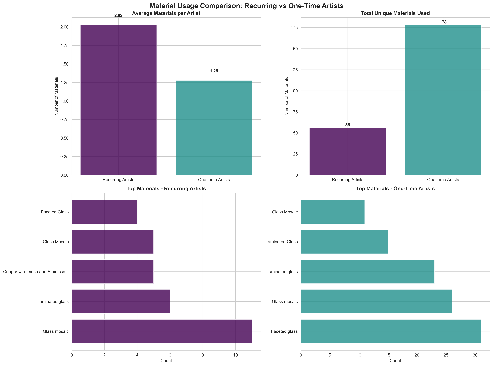

Recurring artist on average use 1.5~ more materials while one-time artists use more unique materials. 

Lastly, I wanted to take a look at the art description feature. For this exploration, I created a bag of words and examined the 20 most commonly used words. To do this I used `nltk` to tokenize and remove stop words. Oddly enough "station" was the most used word. Perhaps I should have spent my time digging into stations rather than agencies. Also, it's no surprise that "glass" the most used material comes in second. Also "ceramic" makes the list.

My favorite words here are "community" and "neighborhood". I think work of this nature serves our community spaces well, strengthens our bonds, and makes us happier, healthier people. Afterall even data science stories deserve a happy ending.

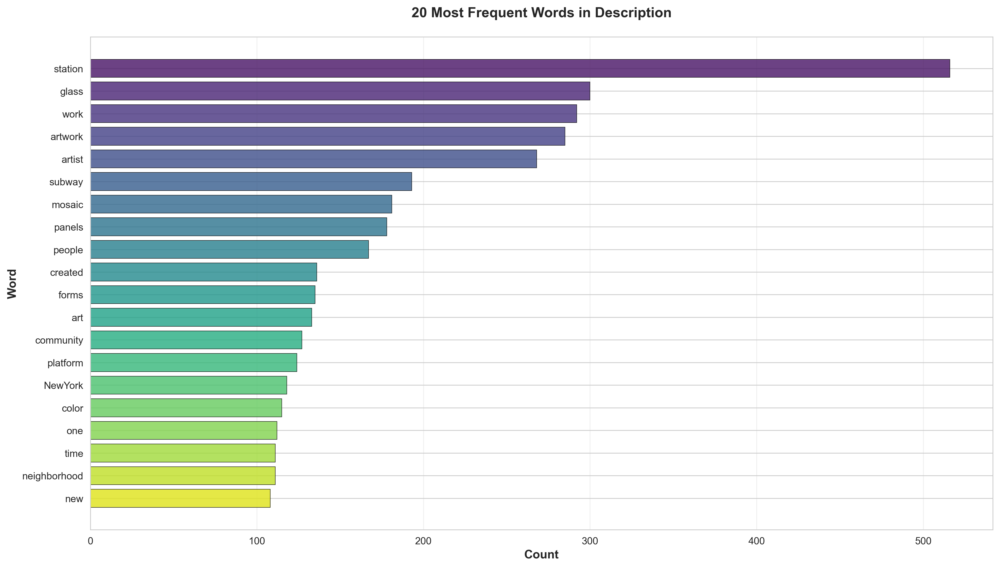


#### 4) Research Questions Evolution

**Original Research Questions:**
- [List your initial research questions from HW1]

**Refined Research Questions:**
- [How have your questions changed after EDA?]
- [What new questions emerged?]

---

## Question 2: AI-Generated Research Questions (10 pts)

### Dataset 1: [Dataset Name]

#### Sub-question (a): AI-Generated Questions

**Generative AI Model Used:**
Gemini 2.5 pro (free for students!)

**Prompt Used:**
I have a dataset that originates from the FEC website around independent expenditures: https://www.fec.gov/data/independent-expenditures/?data_type=efiling&is_notice=true&most_recent=true

Here is a look at the features:
```
<class 'pandas.core.frame.DataFrame'>
Index: 53991 entries, 1997 to 2868
Data columns (total 25 columns):
 #   Column            Non-Null Count  Dtype         
---  ------            --------------  -----         
 0   cand_id           47406 non-null  object        
 1   cand_name         53991 non-null  object        
 2   spe_id            53991 non-null  object        
 3   spe_nam           53988 non-null  object        
 4   ele_type          53991 non-null  object        
 5   can_office_state  45100 non-null  object        
 6   can_office_dis    53972 non-null  float64       
 7   can_office        53978 non-null  object        
 8   cand_pty_aff      46469 non-null  object        
 9   exp_amo           53991 non-null  float64       
 10  exp_date          35873 non-null  object        
 11  agg_amo           53907 non-null  float64       
 12  sup_opp           53950 non-null  object        
 13  pur               53982 non-null  object        
 14  pay               53991 non-null  object        
 15  file_num          53991 non-null  int64         
 16  amndt_ind         53991 non-null  object        
 17  tran_id           53991 non-null  object        
 18  image_num         53991 non-null  int64         
 19  receipt_dat       53991 non-null  object        
 20  fec_election_yr   53991 non-null  int64         
 21  prev_file_num     8418 non-null   float64       
 22  dissem_dt         46187 non-null  object        
 23  exp_date_parsed   35873 non-null  datetime64[ns]
 24  exp_month         35873 non-null  period[M]     
dtypes: datetime64[ns](1), float64(4), int64(3), object(16), period[M](1)
memory usage: 10.7+ MB
```
Looking at this data, what are five research questions you would ask.

**AI Response:**
Of course! Based on the schema of your dataset on FEC independent expenditures, here are five research questions that explore different facets of the data.

### **Five Research Questions**

1.  **What is the relationship between the timing of expenditures and their nature (Support vs. Oppose)?**
    * **Why ask this?** This question investigates the strategic timing of campaign finance. You could analyze if "opposition" spending (negative ads) ramps up closer to an election date compared to "support" spending.
    * **Features to use:** `exp_date_parsed`, `sup_opp`, `exp_amo`, `fec_election_yr`.

2.  **Who are the top 10 spenders (`spe_nam`), and how does their spending break down by candidate party affiliation and support/opposition?**
    * **Why ask this?** This identifies the most influential outside groups in elections. You can create profiles of these top spenders to understand their political alignment and whether their strategy is primarily offensive (opposing candidates) or defensive (supporting candidates).
    * **Features to use:** `spe_nam`, `exp_amo`, `cand_pty_aff`, `sup_opp`.

3.  **How does the purpose (`pur`) of an expenditure differ between high-stakes presidential races versus congressional (House and Senate) races?**
    * **Why ask this?** This question explores how campaign tactics change depending on the office being sought. For example, presidential campaigns might see more spending on broad "media buys," while House races might have more targeted spending on "direct mail" or "phone banks."
    * **Features to use:** `pur`, `can_office`, `exp_amo`.

4.  **Which states attract the most independent expenditure, and is there a correlation between the amount of spending and whether the state is considered a "swing state"?**
    * **Why ask this?** This question delves into the geographic allocation of resources, testing the hypothesis that money flows to the most competitive races where it can have the greatest impact. (Note: You would need to join this data with an external list of swing states for the given election years).
    * **Features to use:** `can_office_state`, `exp_amo`, `fec_election_yr`.

5.  **Is there a significant difference in the average expenditure amount (`exp_amo`) when a candidate is an incumbent versus in an open-seat election?**
    * **Why ask this?** This investigates whether incumbency status affects outside spending strategies. Outside groups might spend more to either defend a vulnerable incumbent or to attack one they see as beatable. (Note: This would require creating a new feature to identify incumbents, possibly by looking at which candidates received spending in previous election cycles).
    * **Features to use:** `cand_name`, `exp_amo`, `fec_election_yr`.

#### Sub-question (b): Question Evaluation

**Question 1:**
I scratched at the surface of this question in looking at the dollars spent and the number of expenditures leading up to the election. However, I like this idea of looking at it through the lens of support/opposition. Did opposition spending ramp up in the months leading up to the election.

**Question 2:**
Great question Gemini! I actually looked at the top 15 spenders. However, more research is needed for this question to provide any real insight. A cool visualization tool would be to develop something that gives you a sense of scale in terms of dollars spent and mission. 

**Question 3:**
Gemini and I are on the same page! This was one of my future research questions. I like this question because I wonder if the methods of outreach differ and state and national levels. It would also be cool to examine the nature of this outreach. Is it more civil at state level? You could also examine this through a geographical lens. Is outreach more civil in certain states?

**Question 4:**
This question would be very interesting to look at over time. Can enough money turn a state into a swing state? Also, how does spending differ by opposition parties in non-swing states? As for Gemini's question, it stands to reason that the most money and time is likely invested in swing states.

**Question 5:**
This is a great question. Although I am not sure this dataset can answer it alone. I believe it would have to be joined onto another dataset. Another thing would that would be interesting to look into is spending on primary candidate challenges.

---

### Dataset 2: [Dataset Name]

#### Sub-question (a): AI-Generated Questions

**Generative AI Model Used:**
[Specify which model you used - ChatGPT, Claude, Gemini, etc.]

**Prompt Used:**
[Include the exact prompt you submitted to the AI model]

**AI Response:**
[Include the complete response from the AI model with the 5 research questions]

#### Sub-question (b): Question Evaluation

**Question 1:**
- [Research question from AI]
- [2-3 sentence explanation of how interesting it is and why]
- [2-3 sentence explanation of feasibility given your EDA results]

**Question 2:**
- [Research question from AI]
- [2-3 sentence explanation of how interesting it is and why]
- [2-3 sentence explanation of feasibility given your EDA results]

**Question 3:**
- [Research question from AI]
- [2-3 sentence explanation of how interesting it is and why]
- [2-3 sentence explanation of feasibility given your EDA results]

**Question 4:**
- [Research question from AI]
- [2-3 sentence explanation of how interesting it is and why]
- [2-3 sentence explanation of feasibility given your EDA results]

**Question 5:**
- [Research question from AI]
- [2-3 sentence explanation of how interesting it is and why]
- [2-3 sentence explanation of feasibility given your EDA results]

---

## Conclusion

[Brief summary of your findings and any final thoughts]
