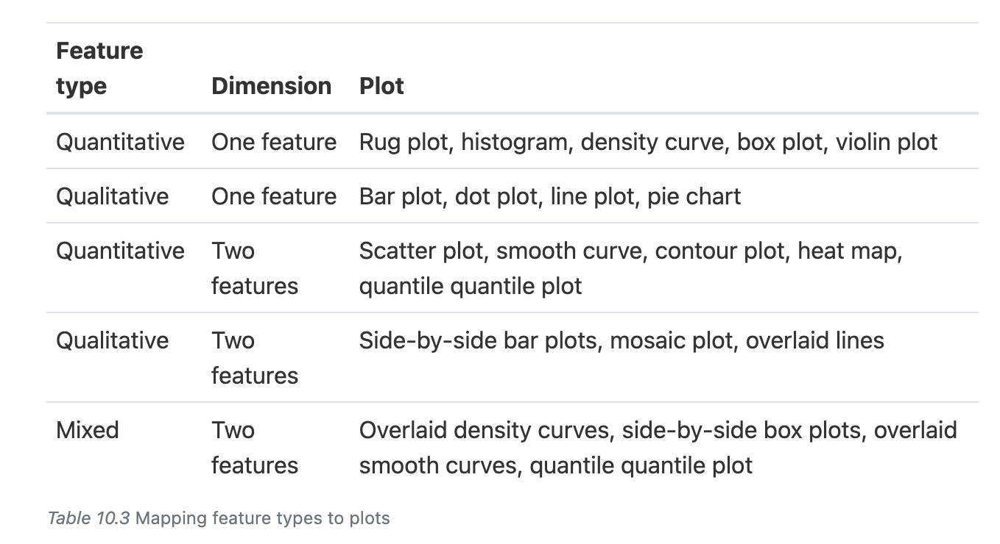
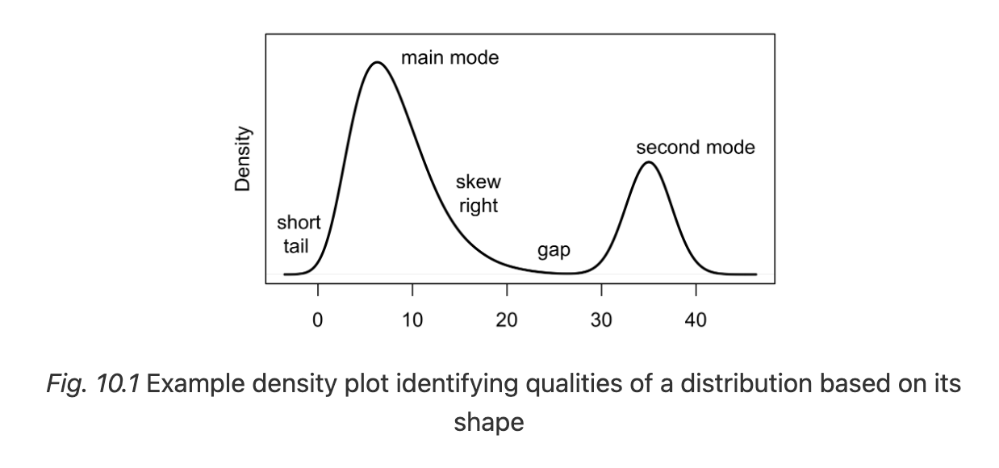

# Data Science 1 - HW 2
**Date:** September 6, 2025  

## Exploratory Data Analysis
### Feature types

Feature types are different than data storage types. Feature types refer to a conceptual notion of th e information. To further illustrate the difference we could say that a feature stored as an integer can represent nominal data.

**Nominal:** A feature that represents "named" categories, where the categories do not have natural ordering. Examples include political party affiliation (Democrat, Republican, Green, Other); dog type (herding, hound, non-sporting, sporting, terrier, toy, working); and computer operating system (Windows, macOS, Linux).

**Nominal:** Measurements that represent ordered categories. Examples of ordinal features are t-shirt size (small, medium, large); Likert-scale response (disagree, neutral, agree); and level of education (high school, college, graduate school).

**Quantitative:** Data that represent numeric measurements or quantities are called quantitative. Examples include height measured to the nearest cm, price reported in USD, and distance measured to the nearest km. Quantitative features can be further divided into discrete, meaning that only a few values of the feature are possible, and continuous, meaning that the quantity could in principle be measured to arbitrary precision. The number of siblings in a family takes on a discrete set of values (such as 0, 1, 2,…, 8). In contrast, height can theoretically be reported to any number of decimal places, so we consider it continuous. There is no hard and fast rule to determine whether a quantity is discrete or continuous. In some cases, it can be a judgment call, and in others, we may want to purposefully consider a continuous feature to be discrete.

### What to look for in a distribution

**mode:** the value that appears most frequently - in a distribution plot the highest peak

**skew:** a measure of the asymmetry of a distribution, indicating whether it is concentrated on one side or the other. This is determined by the length of the "tail" of the distribution. In the chart above, we say its skewed right because the bulk of the data is concentrated on the leftside.

### What to Look For in a Relationship
https://learningds.org/ch/10/eda_relationships.html
