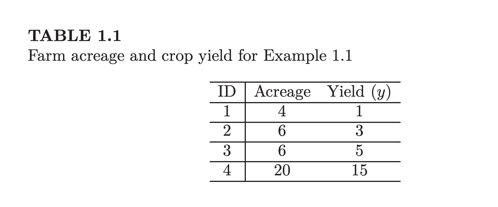
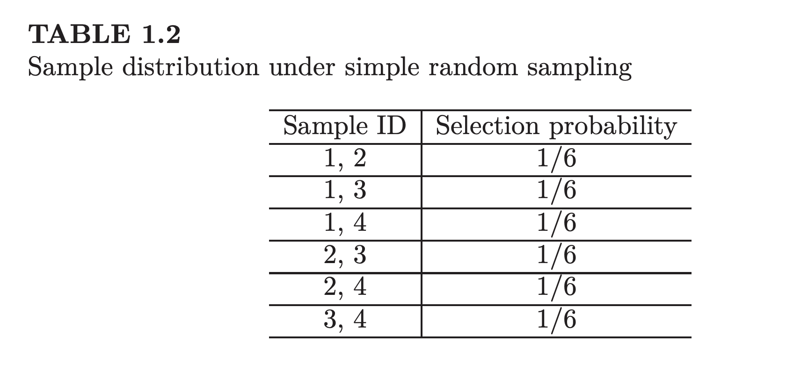
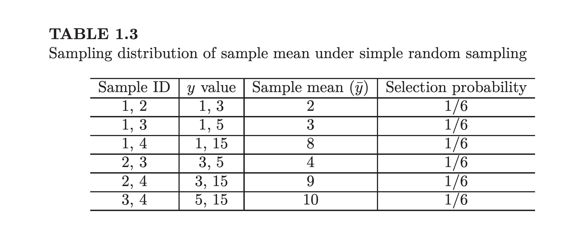

# Data Science 1 - HW 3
**Date:** September 6, 2025  

## Statistics in survey sampling
### A simple example

If we want to determine the average crop yield for farms in a town as represented above but want to use a sample size of 2, we can determine that there are 6 possible ways we can sample the data. 

`C(N,n) = N! / (n!(N-n)!)` where `C(4, 2)`

We can also construct "Sample IDs" as seen in the table below using the 6 sampling possibilities.

From the sample distribution, we can use a random number to select a sample. For example, in Table 1.2, if the random number is 0.4 then {1,4} is selected because
0.4 is greater than 2/6 and less than 3/6.

Unbiasedness of an estimator is a desirable property but it does not mean
that your estimator in a particular sample is close to the true parameter. In
the example above, if sample {1,2} is selected, your estimate of the population
mean is 2, which is much smaller than the truth (=6). That is, unbiasedness
does not imply accuracy.
